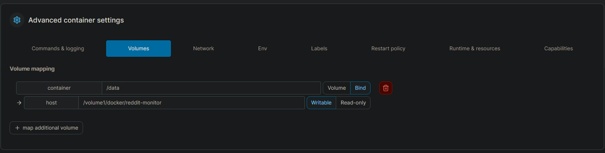

# Reddit Scraper with Push Notifications

This Python script scrapes Reddit for specified keywords in multiple subreddits and sends push notifications for matching posts. I basically use it to track free games on the GameDeals subreddit but you can use it for anything else!

## Prerequisites

Before running the script, ensure you have the following:

- Python installed
- PRAW library (`pip install praw`)
- `dotenv` library (`pip install python-dotenv`)
- `colorama` library (`pip install colorama`)

One can also just requirements.txt file within the repo as well!
```bash
pip install -r requirements.txt
```
## Configuration

1. Create a Reddit account and obtain the necessary credentials (client ID, client secret, user agent, username, and password).
2. Create a Pushover account and obtain the application token and user key.
3. Create a `.env` file in the project root and fill it with your credentials:


4. Customize the `config.json` file with the subreddits you want to monitor and their respective parameters.

```json
{
    "subreddits": [
        {
            "subreddit": "hardwareswap",
            "keywords": ["m50"]
        },
        {
            "subreddit": "frugalmalefashion",
            "keywords": ["fjallraven"],
            "min_upvotes": null,
            "max_notifications": null
        },
        {
            "subreddit": "dogs",
            "keywords": ["dogs", "puppies"],
            "min_upvotes": 30,
            "max_notifications": 3
        },
        {
            "subreddit": "hardwareswap",
            "keywords": ["3080"]
        }
    ],
    "iteration_time_minutes": 5
}
```

## Env file
This is what your .env file should look like


## Usage
Run the script using the following command:

```bash
python bot.py
```
The script will start monitoring the specified subreddits and send push notifications for matching posts.

## Running on Synology
If you want to run this on Synology here:



## License
This project is licensed under the MIT License - see the LICENSE file for details.
